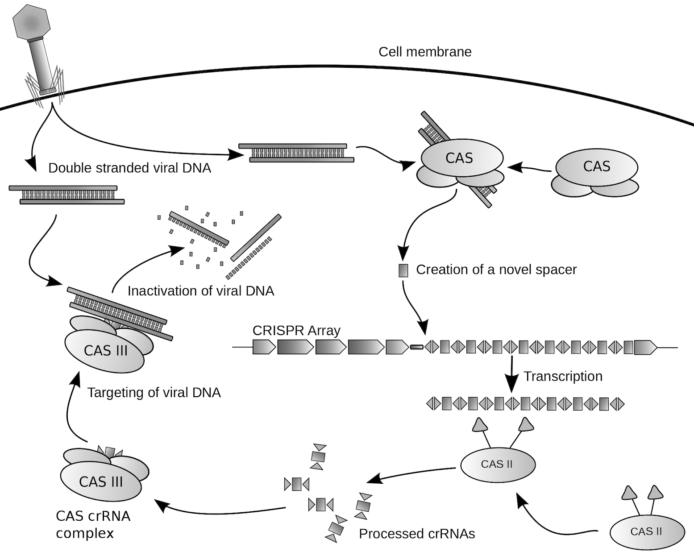

### Clustered Regularly Interspaced Short Palindromic Repeats

Repetitive DNA sequences, called CRISPR, were observed in bacteria with `spacer` DNA sequences in between the repeats that exactly match viral sequences. It was subsequently discovered that bacteria transcribe these DNA elements to RNA upon viral infection. The RNA guides a nuclease (a protein that cleaves DNA) to the viral DNA to cut it, providing protection against the virus. The nucleases are named `Cas`, for `CRISPR-associated`. 

### Genome editing

In 2012, researchers demonstrated that RNAs could be constructed to guide a Cas nuclease (Cas9 was the first used) to any DNA sequence. The so-called guide RNA can also be made so that it will be specific to only that one sequence, improving the chances that the DNA will be cut at that site and nowhere else in the genome. Further testing revealed that the system works quite well in all types of cells, including human cells.

### Implications

With CRISPR/Cas, it’s easy to disrupt a targeted gene, or, if a DNA template is added to the mix, insert a new sequence at the precise spot desired. The method has profoundly changed biomedical research, as it greatly reduces the time and expense of developing animal models with specific genomic changes. Scientists now routinely use the CRISPR/Cas system for this purpose in mice. And for human diseases with a known mutation, such as cystic fibrosis, it’s theoretically possible to insert DNA that corrects the mutation. There are clinical applications in human trials now, including for engineering T cells outside of the body for CAR-T cancer therapy and for editing retinal cells for leber’s congenital amaurosis 10, an inherited form of blindness.

### Limitations

CRISPR/Cas is an extremely powerful tool, but it has important limitations. It is:

- difficult to deliver the CRISPR/Cas material to mature cells in large numbers, which remains a problem for many clinical applications. Viral vectors are the most common delivery method.
- not 100% efficient, so even the cells that take in CRISPR/Cas may not have genome editing activity.
- not 100% accurate, and “off-target” edits, while rare, may have severe consequences, particularly in clinical applications.

### Ethical issues

In addition to editing somatic cells (the cells that make up most of the body), it’s possible to edit the genomes of gametes (eggs and sperm) and early embryos, called germline editing. Any such edits in humans would not only affect an individual but also his or her progeny. They could also theoretically be used to enhance desirable traits instead of curing disease. Scientists have therefore called for a moratorium on human germline editing until the serious ethical and societal implications are more fully understood.

**CRISPR**是存在于细菌中的一种基因，该类基因组中含有曾经攻击过该细菌的病毒的基因片段。细菌透过这些基因片段来侦测并抵抗相同病毒的攻击，并摧毁其DNA。这类基因组是细菌免疫系统的关键组成部分。透过这些基因组，人类可以准确且有效地编辑生命体内的部分基因，也就是CRISPR/Cas基因编辑技术。

CRISPR/Cas系统是目前发现存在于多数细菌与绝大多数的古菌中的一种后天免疫系统，以消灭外来的质粒或者噬菌体，并在自身基因组中留下外来基因片段作为“记忆”。CRISPR的全称是Clustered Regularly Interspaced Short Palindromic Repeats。目前已发现三种不同类型的CRISPR/Cas系统，存在于大约40%和90%已定序的细菌和古菌中。其中第二型的组成较为简单，以Cas9蛋白以及向导RNA（gRNA）为核心的组成。Cas9是第一个被广泛应用的CRISPR核酸酶，其次是[Cpf1](https://en.wikipedia.org/wiki/CRISPR/Cas12a)，其在新泽西弗朗西斯菌的CRISPR/Cpf1系统中被发现。

由于其对DNA干扰的特性，目前被积极地应用于遗传工程中，作为基因体剪辑工具，与锌指核酸酶（[ZFN](https://en.wikipedia.org/wiki/Zinc_finger_nuclease)）及类转录活化因子核酸酶（[TALEN](https://en.wikipedia.org/wiki/Transcription_activator-like_effector_nuclease)）同样利用非同源性末端接合（[NHEJ](https://en.wikipedia.org/wiki/Non-homologous_end_joining)）的机制，于基因体中产生DNA的双链断裂以利剪辑。第二型 CRISPR/Cas经由遗传工程的改造应用于哺乳类细胞及斑马鱼的基因体剪辑。其设计简单以及操作容易的特性为最大的优点，目前已逐步应用在各种不同的模式生物当中。

> The field of DNA editing and medical genetics is changing much faster than we think. AI and CRISPR technology have been making revolutionary changes to the field of medicine. Artificial Intelligence is being applied in identification of harmful genes and treatment of disease. For the specific use cases and applications and numerous the importance of AI in healthcare, and its impact on the biotech industry could grow exponentially in the near future. Multiple new gene editing technologies in addition to Artificial Intelligence will cause major changes in healthcare.

> The gene editing tool CRISPR, short for `Clustered Regularly Interspaced Short Palindromic Repeats` could help us to reprogram life. It gives scientists more power and precision than they ever had to alter human DNA. This new power includes the possibility of making people smarter. Even before CRISPR was used on human embryos, the technology was used to modify simple animals. There the goal was to demonstrate that the technology worked these experiments made us aware that with CRISPR, we could do a lot more than we previously thought we could. Scientists use CRISPR to change delete or add DNA to any organism from a human embryo to a pig to a wheat crop. CRISPR does this by subduing a specific part of the genome and then injecting a new piece of DNA into the genome instead.

> So CRISPR is an acronym for basically a system that is from bacteria, that they use to kill and destroy the DNA of invading organisms, like a virus. But we can now use that system to cut and change our own genomes, it's basically a DNA cutting enzyme, that doesn't cut randomly. You can give it a barcode in the form of what's called the RNA molecule, that tells where that enzyme will cut in the genome. Let's say you have a terrible gene that's causing heart disease. We take this CRISPR system, we say here's where you need to go to cut, we can tell the enzyme to go and cut it put it into your cells. It'll go cut it and destroy that enzyme and delete it, and you can also use it to cut the genome and insert new pieces. So you can both subtract and add DNA at will now not just randomly. But what's important is you can tell it where to go and that's the big breakthrough.

> Currently gene editing is already used in research fields such as human health, agriculture and environmental protection. However CRISPR as a tool for human genetic engineering is still in its early stage development. With the development of CRISPR as a tool for genetic engineering it is possible that more scientific advances are to come.

> Let us consider the possible advantages and disadvantages of this technology. In case of diseases, CRISPR has a lot of potential advantages. CRISPR technology holds a lot of promises but we should be careful in applying it to humans animals and plants, as it may promote and accelerate some negative phenomena on the environment and on humans. Moreover many potential side effects have not been analyzed yet could it be conceivable that at one point in the future we could increase the average IQ of the population. According to UCLA neurobiologists the work in mice demonstrates the answer maybe yes.

> Sometimes a person or animal is born with a mutation in their genome, these mutations can be small or large, and they can have many different effects, such mutations are often purposeless or random and they can have no effect on our intelligence. This shown by the fact that gene mutations that happened millions of years ago, are still present in the genes of living organisms on earth. Evolution has had plenty of time to correct them and eradicate them, but many of them are still there.

> In fact many of the mutations that show up in human DNA are harmful, the apparently large genetic contribution has detrimental effects on everyday life. Ranging from a person being slightly more vulnerable to certain diseases to mental retardation to causing death immediately after birth. CRISPR technology in the future could enable efficient and affordable treatment of diseases such as diabetes, Alzheimer's, cystic fibrosis, muscular dystrophy or even rheumatoid arthritis.

> We believe we understand how to slow aging, there are genes that predispose you to a long life. We could make offspring a family that would potentially live a lot longer, actually there are drugs that are in development to actually correct genetic diseases such as vision loss. What we're showing is in mice at least we can reverse the age of the retina, and restore the vision of old mice. So we'd reprogram the eye to be young again. So we now know that there's a set of genes called reprogramming factors also known as [Yamanaka factors](https://pubmed.ncbi.nlm.nih.gov/19030024/) that are from named after this Japanese fellow, who won the Nobel prize in 2012. These factors are used all over the world even to reprogram skin cells other cells to be what we call pluripotent stem cells. These are cells that can be used to make new organs or new blood cells. But what people hadn't tried until recently was can you do this in a living animal, or are you just going to mess it u. And what we found out is that if you do it the wrong way you mess up the animal and it'll die. But what we've shown for the first time in this paper is you can do it in a safe way, and not only that reverse the clock make the cells young and restore how they work, and get back vision.

> CRISPR was originally designed as a technique for editing the DNA in living organisms but its uses and capabilities have expanded substantially it is now used wildly for biomedical research including research into human genetics. One of the main issues concerning technologies such as CRISPR-cas9 is accuracy and safety. As mistakes can have significant and dangerous consequences when it comes to an individual's genome. However CRISPR technology has a lot of potential benefits. It is not a completely new idea and it can help treat diseases and genetic anomalies and many scientists have made potential progress that CRISPR cache 9 may be safer than viral therapies.

> Many people have expressed concerns about crest by technologies because they think it is incredibly controversial. There are questions of ethics and fairness as it could probably only be available to the wealthy, to create designer babies with increased levels of intelligence. Intelligence is too complex to engineer, however many researchers think that intelligence is influenced by genes and environment. Genes affect the developing baby's brain and environmental factors influence how the brain is used, thus it is possible that genetically engineered babies could be smarter as a result of the increased amount of oxygen to the developing brain, thanks to gene editing. Research experiments already exist that creates smart mouse babies. Question is whether it is going to be possible to accomplish the same with human beings.

> And in the mice, to restore the vision we have this three gene combination of these [Yamanaka](https://en.wikipedia.org/wiki/Shinya_Yamanaka) reprogramming genes. We put them into the eye and then we turn them on with a drug called doxycycline is the same drug we can feed to the mice turns on the reprogramming genes for a few weeks, restores their vision back to a young mouse, and then we just take away the doxycycline and antibiotic, and the mice have their vision back. That's the future, that you'll get a delivery of this virus, you'll take the antibiotic for a few weeks be fully rejuvenated, and the doctor says come back in a couple of decades we'll fix you again. I'll give you some antibiotics in a couple of decades but then it gets really weird if you have if you engineer your children to have this system, and you have people engineered to be able to be reversed in their age. Or let's say they have an accident, and their optic nerve gets damaged or they lose their hearing, give them a dose of an [IV of antibiotics](https://www.careandwear.com/blogs/community/120992963-learn-more-on-the-different-types-of-iv-antibiotics-how-they-are-administered-and-the-pros-and-cons), and they become just like an embryo, they can rejuvenate, they can regrow their optic nerve, regrow their spine fixed back like new.

> It may be possible that in the future, our genealogical records might be included in computer databases, and future computer programs could use it. The advancements in Artificial Intelligence and CRISPR technology can make it possible to one day, create a new breed of human machine hybrids, however the question concerning the safety of such technique in relation to humans is ongoing. We do not fully understand all the mechanisms related to the editing of the human genome. Additionally the long-term and short-term effects of the gene editing interventions in humans are still unclear.

> CRISPR has given the scientific community a great leap. The prospect of improving our understanding of the genome will likely stimulate advances in both Artificial Intelligence and predictive medicine. The possibility of altering the sequences of genes and correcting the mistakes that were previously irreversible, opens many new possibilities for research. Nevertheless for now genetic editing technology is still incapable of making the hundreds of changes presumably necessary to make a super intelligent human, but the corresponding ethical issues deserve serious attention before these capabilities become a reality.

> [watch this video](https://www.youtube.com/watch?v=ybaMW2WvaBE)

<!--more-->
